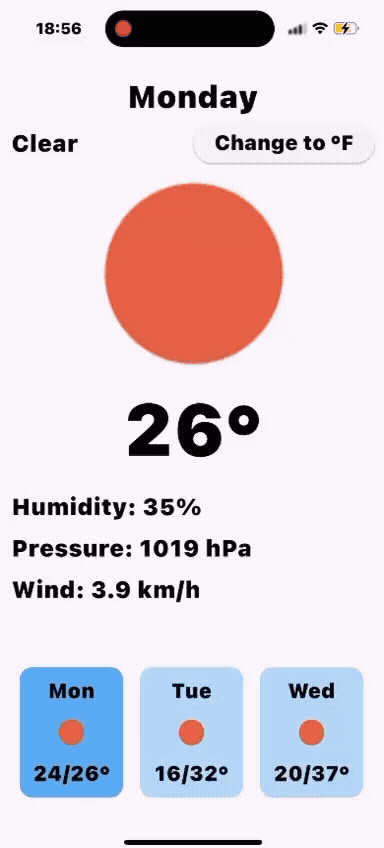
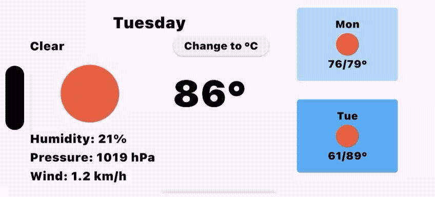

# 🌤️ Weather App

A simple and clean Flutter app to display 5-day weather forecasts using the OpenWeather API.  
Supports both portrait and landscape modes with a temperature unit toggle between Celsius and Fahrenheit.

## 🚀 Features

- View current and 5-day weather forecast
- Support for **landscape** and **portrait** layouts
- Toggle between °C and °F
- Pull-to-refresh to update the forecast
- Responsive UI with `flutter_screenutil`
- Built-in `.env` support for secure API key storage

## 📱 Demo Preview




##  📁 Folder Structure (Clean Architecture Inspired)

<pre>
lib/
├── core/
│   ├── constants/
│   ├── error/
│   ├── services/
│   ├── theming/
│   └── utils/
├── features/
│   └── weather/
│       ├── data/
│       │   ├── models/
│       │   ├── datasources/
│       │   └── repository/
│       ├── domain/
│       │   ├── entities/
│       │   └── repository/
│       └── presentation/
│           ├── bloc/
│           ├── screens/
│           └── widgets/
</pre>


## 🧰 Packages

- **State management** with `BLoC`
- **HTTP networking** with `Dio`
- **Environment config** with `flutter_dotenv`
- **Dependency Injection** with `get_it`
- **Functional programming** with `dartz`
- **Equality & Value Comparison** with `equatable`
- **Responsive UI Design** with `flutter_screenutil`
- **Cached Image Loading** with `cached_network_image`
- **Date Formatting & Localization** with `intl`


---
## 🚀 Getting Started

### 1. Clone the Repository
```bash
git clone https://github.com/abdullah-khudher/speech_summary_app.git
cd speech_summary_app
```

### 2. Add API Keys
Create a `.env` file in the root directory:
```env
OPENWEATHERMAP_API_KEY=your_open__weather_map_api_key_here
BASE_URL=https://api.openweathermap.org/data/2.5
```

✅ `.env` is already in `.gitignore`.

### 3. Install Dependencies
```bash
flutter pub get
```

### 4. Run the App
```bash
flutter run
```
